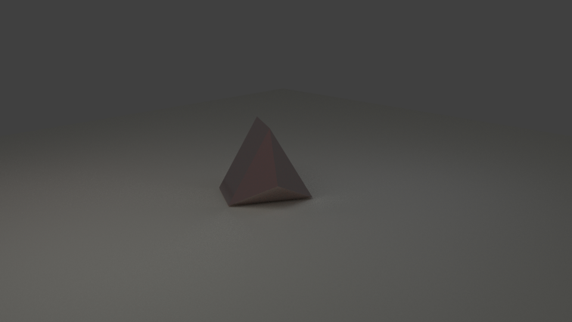
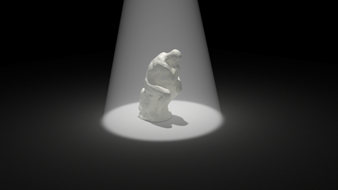

# La 3D avec Blender
[INDEX](readme.md) >> L'éclairage

>Pour bien mettre en valeur vos solides, vous aurez besoin de créer un sol. Les ombres portées renforceront sa présence et sa perception.

## Plusieurs lumières

Pour avoir un volume bien éclairé, il est bon d'avoir plusieurs éclairages:
Pour une ilumination global, placer un éclairage , plutôt proche pour des scènes en intérieur, plutôt loin pour des scènes en extérieur, assez forts.

>L'éclairage dans *Blender Cycle* se fait avec des faces solides ausxquelles on appliquera le shader *Emission*.

Pour atténuer les ombres, placez un ou deux plans lumineux plus faibles, vous pouvez également les teintés pour renforcer un aspect photo-réaliste.

[télécharger le fichier d'exemple](fichiers-blender/trois-lumieres.blend)

## Un éclairage volumétrique

L'éclairage volumétrique est un éclairage très direct, *Blender Cycle* n'a pas encore de fonctionnalité permettant d'en créer très facilement,on peut quand même le simuler en créant un volume lumineux. Pour ne pas trop marqué les bords du volumes, on va utiliser une texture transparente qui va venir atténuer le *shader* emission.

[télécharger le fichier d'exemple](fichiers-blender/volumetric-lighting.blend)
