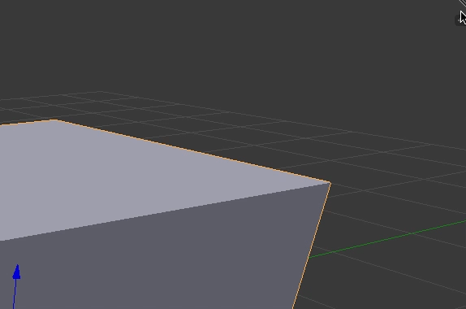
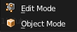

# La 3D avec Blender
[INDEX](readme.md) >> Le plan de travail

- [La vue](#)
- [Les modes d'éditions](#)

## La vue
Par défaut, il n'y a qu'une vue 3D de la scène.

Avec la souris, vous pouvez vous déplacer dedans :
- le <em>scroll</em> permet de zoomer /dézoomer
- en cliquant sur la molette de <em>scroll</em> vous pouvez tourner autour de votre repère

Avec le clavier:
- ```4``` et ```6``` : faire une rotation vers la gauce ou la droite
- ```8``` et ```2``` : faire une rotation vers le haut ou le bas
- ```0``` : entrer et sortir de la vue caméra
- ```5``` : vue en perspective ou orthographique
- ```7``` : vue de dessus
- ```1``` : vue de face
- ```3``` : vue de cotès
- &uArr; (maj) + ```C``` : recentrer le repère et la vue sur le centre de la scène
- en ayant un objet sélectionné  &uArr; (maj) + ```.``` : recentrer le repère et la vue sur l'objet.


<br />

 

Si vous souhaitez avoir plusieurs vues 3D, faite glisser le coin supérieur droit vers l'intérieur de la vue.

## Les modes d'éditions



Vous pouvez modifier les objets selon deux modes, le premier, <em>object mode</em> vous permettra de déplpacer, mettre à l'échelle, faire des rotations sur un objet, le deuxième, <em>edit mode</em> vous permettra de faire ces même opérations et d'autres dans l'objet sélectionné. L'<em>edit mode</em> sert principalement à modifier certaines parties ou composantes de l'objet / <em>mesh</em>.

Vous pouvez à tout moment basculer entre ces deux modes avec la touche &rlarr; (tab) de votre clavier.
