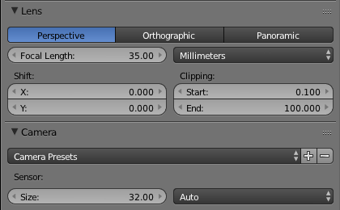
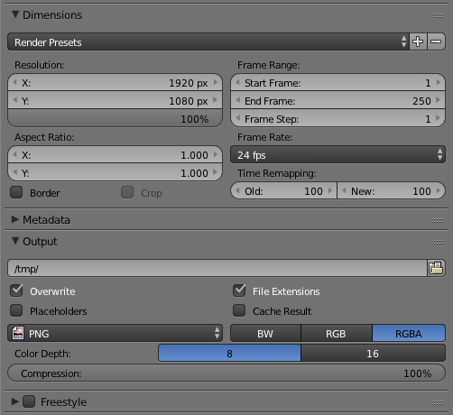

# La 3D avec Blender
[INDEX](readme.md) >> Le rendu 3D

## La caméra

La caméra à différents réglages :

- *Focal* Length : pour changer d'optique ( grand angle, 35mm, ... )
- *Start* : définit l'endroit ou commence la mise au point
- *End* : définit l'endroit ou finit la mise au point

Il est possible d'avoir un repère visuel pour les deux dernièrs réglages.
Vous trouverez aussi dans l'onglet *Camera Presets* différents modèles d'appareils photo et de caméras.

## Les reglages d'export

Ici on a :
- Resolution -> X : la largeur de l'image
- Resolution -> Y : la hauteur de l'image
- Le pourcentage : une échelle de qualité ( pourcentage de la largeur est la hauteur ), utile pour faire des pré-rendu
- Aspect ratio -> X : le rapport de largeur (entre la largeur et la hauteur) ex1 : 16, ex2 : 4
- Aspect ratio -> Y : le rapport de hauteur (entre la largeur et la hauteur) ex1 : 9, ex : 3
