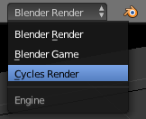
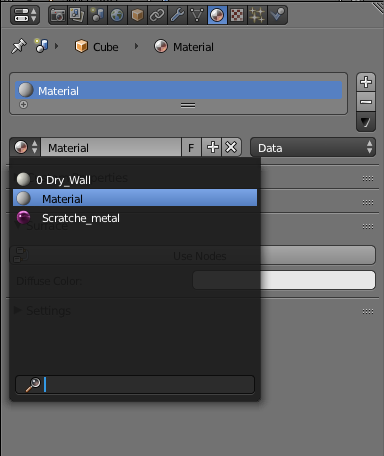

# La 3D avec Blender
[INDEX](readme.md) >> Les matériaux
## Cycle
 Ici nous traiterons les matériaux avec le moteur de rendu *Cycle*, pour continuer vous devez changer le moteur de rendu en haut de la vue 3D.
### Pourquoi utiliser *Cycle* et pas le moteur de rendu par défaut, *Blender render* :  
>*Cycle* permet d'avoir plus facilement un rendu photo-réaliste, on peut aussi prévisualiser le matériel et la texture sans faire de rendu. Il a un aspect plus granulaire que le moteur de rendu par défaut.


## Installer une collection de matériaux

   
<small>Source image : [http://addictedtocg.com/](http://addictedtocg.com/)</small>

Vous pourrez télécharger une collection de matériaux [ici](http://www.mediafire.com/download/ayvtjk3soa5a69a/Blender_Materials.7z).
Pour l'utiliser, dans la barre de menu en haut, aller dans ```File``` puis dans ```Append```, aller à l'emplacement du fichier et sélectionner le matériel que vous souhaiter.


Si on va dans les réglages des matériaux, on trouvera désormais le matériel que vous venez d'importer. Si vous avez sélectionné un solide, vous pourrez lui appliquer ce matériel.

## Les *shaders*

Le matériel est définit par les réglages que l'on donne aux shaders, si vous voulez en savoir plus, je vous recommande [cet article]( http://www.blenderguru.com/articles/cycles-shader-encyclopedia/) qui explique à peu près tout sur le sujet.  
