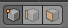
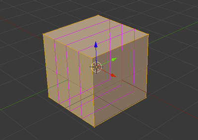

# La 3D avec Blender
[INDEX](readme.md) >> Les modes d'éditions et les objets
___

## Les composants des objets


Il existe dans tout les logiciels de 3D la même dénomination pour les composants d'un objet.

- le point /<em> vertice </em>
- le segment /<em> edge </em>
- la face /<em> face </em>


## Les pricipaux raccourcis
Les commandes les plus courantes ( communes aux <em>object mode</em> & <em> edit mode</em> ):
- ```g``` (grab) * : déplacer la sélection
- ```r``` (rotate) * : appliquer une rotation à la sélection
- ```s``` (scale) * : changer l'échelle de la sélection

Les commandes spécifiques au <em>edit mode</em>
- ```e``` (extrude) * : extruder la sélection


- ```ctrl``` + ```r``` : découper une face ou un segment en plusieurs sections ( choisir le nombre de division avec la molette de la souris )

*: objet / face(s) / segement(s) / point(s)

Vous pouvez, après avoir lancer ces commandes, appuyer sur ```x```, ```y``` ou ```z``` pour vérouiller la modification sur ces axes.

Vous pouvez aussi, après avoir vérouiller un axe, définir une valeur à l'aide de votre clavier.


## Sélection

La prise en main de Blender peut sembler déroutante au début, car dans la scène, le clique droit sert à la selection d'objet et le clique gauche permet de déplacer un repère qui servira à déplacer les objets ou <em>mesh</em>.


- ```a``` : tout sélectionner / tout déselectionner
- ```b``` : créer un sélection en traçant un rectangle
- ```c``` : créer une sélection en déplaçant un cercle ( le zoom / dézoom de la molette de la souris permettra de modifier son rayon)
- ```x``` : supprimer la sélection
- &uArr; (maj) + ```D``` : duppliquer la sélection
