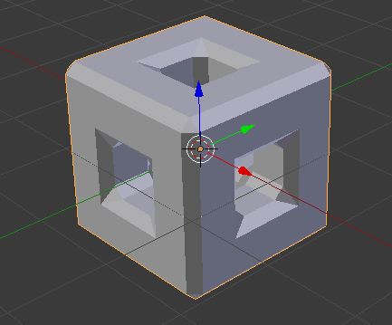

# La 3D avec Blender
[INDEX](readme.md) >> Les techniques de modélisations

## Le modifieur *mirror*

Ce modifieur se révèle trés pratique pour modéliser des objets symétriques. Pour pouvoir l'utliser correctement, il faudra que les faces qui vous servent de modèles à duppliquer soient décentrer ( le centre est marqué par le widget de déplacment ). Le plus simple est de partir d'une forme complète, celle ci doit avoir une taille équivalente à l'objet finale. En *edit mode* vous allez supprimer toutes les faces que vous voulez reconstituer par la suite avec le modifieur mirroir.

[Télécharger le fichier d'exemple](fichiers-blender/modifieur-mirroir.blend)

[En savoir plus sur le modifieur mirroir](https://www.blender.org/manual/modeling/modifiers/generate/mirror.html)
## Le *Spin*

Cet outil doit être utiliser comme le modifieur mirroir. Le profil qui va être répété en tournat doit toujours être excentrer sinon il va tourner sur lui-même.

[Télécharger le fichier d'exemple](fichiers-blender/outil-spin.blend)

[En savoir plus sur l'outil *spin*](https://www.blender.org/manual/modeling/meshes/editing/duplicating/spin.html)

## Array

Un modifieur de multiplication d'un objet avec un paramètre de décalage: il dupplique votre objet de base, si vous modifiez votre objet, il reproduira les modifications sur les copies.

[Télécharger le fichier d'exemple](fichiers-blender/array-modifier.blend)

[En savoir plus sur le *Array modifier*](https://www.blender.org/manual/modeling/modifiers/generate/array.html)

 
 
 

## Subdivision de surface

Un démultiplicateur de points avec une option de lissage, se révèle très pratique pour avoir un *mesh* avec une meilleur définition qui se modifie facilement. Prudence toutefois : plus le maillage et fin plus le calcul 3D est lent.

[En savoir plus sur le modifieur de subdivision de surface](https://www.blender.org/manual/modeling/modifiers/generate/subsurf.html?highlight=subdivision)

 
 
 
## Le *Bevel*

Un outil pour biseauter les arrêtes : il ajoute une ou plusieurs nouvelle face entre les deux faces que réunissaient une arrête.

[Télécharger le fichier d'exemple](fichiers-blender/modifieur-bevel.blend)

[En savoir plus sur le *bevel*](https://www.blender.org/manual/modeling/modifiers/generate/bevel.html)
 
 
 

## Le *Screw*

L'outil *screw* est similaire au *spin* puisqu'il fait tourner un arrête en la duppliquant. Comme le modifieur *array* il a un paramêtre de décalage.

[Télécharger le fichier d'exemple](fichiers-blender/screw-modifier.blend)

[En savoir plus sur le *screw*](https://www.blender.org/manual/modeling/meshes/editing/duplicating/screw.html)
 
 
 
## Curve

Le modifieur *curve*, comme son nom l'indique sert à courber un *mesh* à l'aide de courbe. En déplaçant /extrudant les points de la courbe vous pourrez courber votre *mesh*.

[Télécharger le fichier d'exemple](fichiers-blender/modifieur-courbe.blend)

[En savoir plus sur modifieur *curve*](https://www.blender.org/manual/modeling/modifiers/deform/curve.html)
