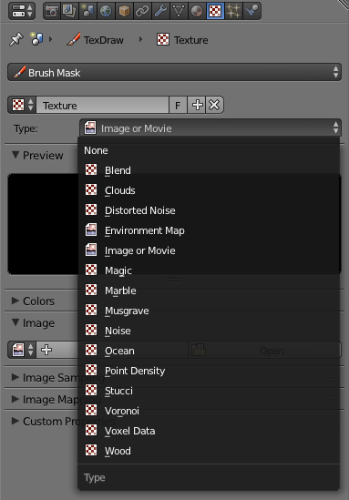
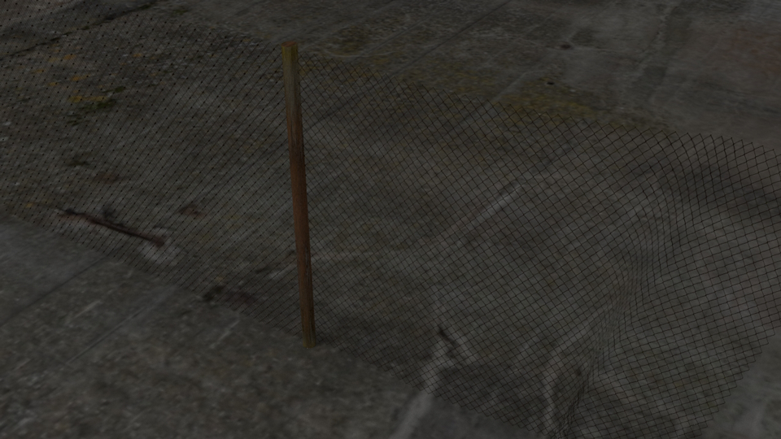

# La 3D avec Blender
[INDEX](readme.md) >> Les textures

## Défintion

Les textures sont liées au matériel, si vous appliquez plusieurs matériaux, vous pourrez alors y coller plusieurs textures.

Dans la plupart des cas, la texture est une sorte de coloriage qui s'applique au matériel, elle ne définit pas la manière qu'à la lumière d'intégagir avec le solide.

- *Blend* : couleur unie ou dégradé
- *Clouds* : une texture de nuage
- *Distorded Noise* : une texture distordu semblable à une explosion
- *Environment Map* : une texture à 360° utilisée pour les *Skybox*
- *Image or Movie* : à vous de voir
- *Magic* : une texture d'onde
- *Marble* : une texture marbrée
- *Musgrave* : une texture cottonée
- *Noise* : une texture de bruit
- *Ocean* : une texture spéciale pour les étendues d'eaux
- *Point density* : une texture de halo réagissant aux particules
- *Stucci* : une texture pour les murs et le papier
- *Voronoi* : une texture en forme de cellule
- *Voxel Data* : une texture de cheveux, de fumée réagissant aux particules
- *Wood* : une texture de bois

## UV mapping

Pour les images qui doivent être *mappée* d'une manière trés précise, il vous faudra, déplié votre solide avec *Blender* en *UV editing*. Voici [un tutoriel](https://openclassrooms.com/courses/uv-mapping-avec-blender) qui vous explique comment faire.

Vous pouvez aussi télécharger un [fichier d'exemple ici](fichiers-blender/mpd24.zip).

Il existe une extension pour créer un plan ( au ratio de votre image ) avec votre image déjà mappé dedans, vour pourrez la [télécharger ici](https://wiki.blender.org/index.php/Extensions:2.6/Py/Scripts/Add_Mesh/Planes_from_Images).

## Bump map & Co.

Certaine textures vont directement influencer, les rebonds de lumières, la profondeur de l'image mappée et peuvent même faire des trous dans le matériel.

Voici [un tutoriel vidéo](https://www.youtube.com/watch?v=NeWTTINkUG0) pour réaliser une *specular map*, ( une carte qui va décrire comment votre solide va accrocher la lumière ) ainsi qu'une *bump map* ( une carte qui va renforcer la profondeur d'une autre texture).

Vous pouvez aussi télécharger le [fichier d'exemple](fichiers-blender/mapping.blend) ou vous trouverez:
- *alpha map*
- *diffuse map*
- *normal map*
- *specular map*
- *bump map*
- *ambient occlusion map*
