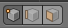

# La 3D avec Blender
[INDEX](readme.md) >> Les modes d'éditions et les objets


## Les composants des volumes


Il existe dans tout les logiciels de 3D la même dénomination pour les composants d'un objet.

- le point /<em> vertice </em>
- le segment /<em> edge </em>
- la face /<em> face </em>


## Les pricipales commandes
Les commandes les plus courantes ( communes aux <em>object mode</em> & <em> edit mode</em> ):
- ```g``` (grab) * : déplacer la sélection
- ```r``` (rotate) * : appliquer une rotation à la sélection
- ```s``` (scale) * : changer l'échelle de la sélection
- ```ctrl``` + ```m```  * : mirroir

Les commandes spécifiques au <em>edit mode</em>
- ```e``` (extrude) * : extruder la sélection
- ```f``` (face) : créer des segments ou des faces à partir d'une sélection de points


- ```ctrl``` + ```r``` : découper une face ou un segment en plusieurs sections ( choisir le nombre de division avec la molette de la souris )

*: objet / face(s) / segement(s) / point(s) : Vous pouvez, après avoir lancer ces commandes, appuyer sur ```x```, ```y``` ou ```z``` pour vérouiller la modification sur ces axes.  Vous pouvez aussi, après avoir vérouiller un axe, définir une valeur à l'aide de votre clavier.

> Certaines commandes n'ont pas de raccourci, vous devez les retrouver dans le panneau latéral droit, ou ( et cela marche pour toute les commandes ) appuyer sur espace et taper le nom de la commande.

La commande *```merge```* vous permettra de fusionner plusieurs points.
La commande *```subdivide```* vous permettra multiplier le nombre de points.


## Sélection

La prise en main de Blender peut sembler déroutante au début, car dans la scène, le clique droit sert à la selection d'objet et le clique gauche permet de déplacer un repère qui servira à déplacer les objets ou *mesh*


- ```a``` : tout sélectionner / tout déselectionner
- ```b``` : créer un sélection en traçant un rectangle
- ```c``` : créer une sélection en déplaçant un cercle ( le zoom / dézoom de la molette de la souris permettra de modifier son rayon)
- ```x``` : supprimer la sélection
- &uArr; (maj) + ```D``` : duppliquer la sélection

> Blender peut récupérer des sélections automatiquement si ses points sont alignées. Pour cela, vous devez sélectionner au moins deux points (maintenez &uArr; enfoncé ) puis sélectionner le troisième en maintenant &uArr; et ```alt```.


> Vous pouvez aussi enregistrer des sélections de points dans le panneau latéral gauche.
